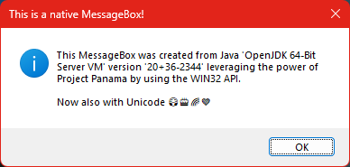

# Project Panama Showcase - Unicode Windows API

This repository contains a small demo for Java 20 using the new foreign function interface, codename `Project Panama`.
It makes use of the new features to show a Unicode message box by instrumenting the Windows API.

> **Note**
> Please note that the foreign function API is still in preview.
> To run the demo add `--enable-preview` to your java vm arguments.

